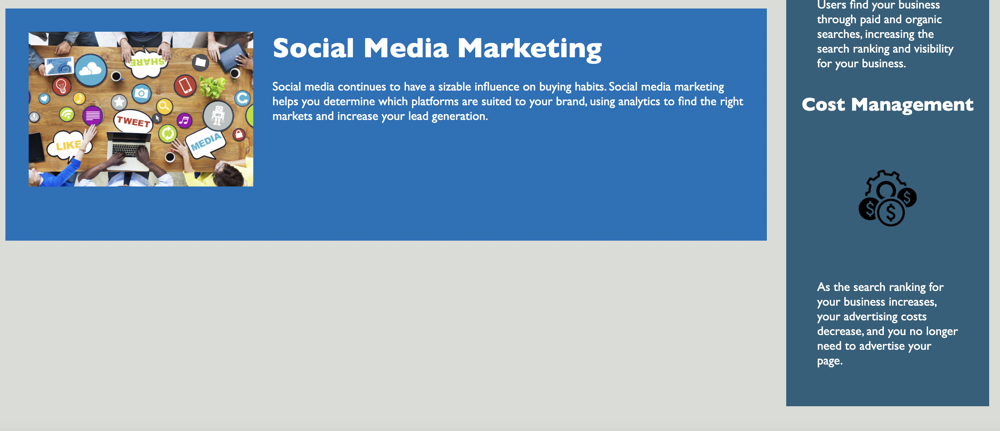

# jasdjames-homework1-develop-assessibility1

## Description 
The purpose of this project was to make the Horiseon page more accessible and more viable using semantic HTML and elements . The project also included some consolidation and renaming CSS elements to make them more semantic as well.  

The process included: 

- Changing generic HTML Divs to more Semantic elements (i.e. Div to Section)
- Changing Div IDs to Semantic tags 
- Changing CSS classes to semantic elements 
- Making the Nav bar more semantic by using "Nav" instead of an ordered list in a div 
- Making similar changes in the CSS 
- Making the CSS more concise and reader friendly 
- Adding Comments to the CSS
- Fixing a broken (misspelled link) in the HTML
- Re-organizing HTML 
- Removing unused classes 
- Overall organization and ordering of the HTML and CSS
- Changed background colors for assessibility 

## Installation

This project is listed in the the GitHub repostitory at this is link [GitHub Repository](https://github.com/jasdjames/jasdjames-homework1-develop-assessibility1)

This page has been deployed here [Page] (https://jasdjames.github.io/jasdjames-homework1-develop-assessibility1/)

## Usage 

The page functions in the same way as the original with the exception of the the broken link for "search engine optimization" that has been fixed. The HTML and CSS has become more semantic with alt attributes added to the images. Screenshots are provided below. 

## Credits

I used the following tutorials and reference guides as assistance in completing this task 
- [W3 Schools HTML Alt Attributes] (https://www.w3schools.com/tags/att_img_alt.asp)
- [The HTML Section Heading elements -Devloper.Mozilla] (https://developer.mozilla.org/en-US/docs/Web/HTML/Element/heading_elements#Usage_notes)
- [W3 Semantic Code] (https://www.w3schools.com/html/html5_semantic_elements.asp)
- [The Semantic Web as a language of logic] (https://www.w3.org/DesignIssues/Logic.html)
- [W3 Comments] (https://www.w3schools.com/css/css_comments.asp)
-  [https://choosealicense.com/](https://choosealicense.com/)
- [https://webaim.org/resources/contrastchecker/] (https://webaim.org/resources/contrastchecker/)

## License

 MIT License

Copyright (c) [2020] [JasDJames]

Permission is hereby granted, free of charge, to any person obtaining a copy
of this software and associated documentation files (the "Software"), to deal
in the Software without restriction, including without limitation the rights
to use, copy, modify, merge, publish, distribute, sublicense, and/or sell
copies of the Software, and to permit persons to whom the Software is
furnished to do so, subject to the following conditions:

The above copyright notice and this permission notice shall be included in all
copies or substantial portions of the Software.

THE SOFTWARE IS PROVIDED "AS IS", WITHOUT WARRANTY OF ANY KIND, EXPRESS OR
IMPLIED, INCLUDING BUT NOT LIMITED TO THE WARRANTIES OF MERCHANTABILITY,
FITNESS FOR A PARTICULAR PURPOSE AND NONINFRINGEMENT. IN NO EVENT SHALL THE
AUTHORS OR COPYRIGHT HOLDERS BE LIABLE FOR ANY CLAIM, DAMAGES OR OTHER
LIABILITY, WHETHER IN AN ACTION OF CONTRACT, TORT OR OTHERWISE, ARISING FROM,
OUT OF OR IN CONNECTION WITH THE SOFTWARE OR THE USE OR OTHER DEALINGS IN THE
SOFTWARE.

